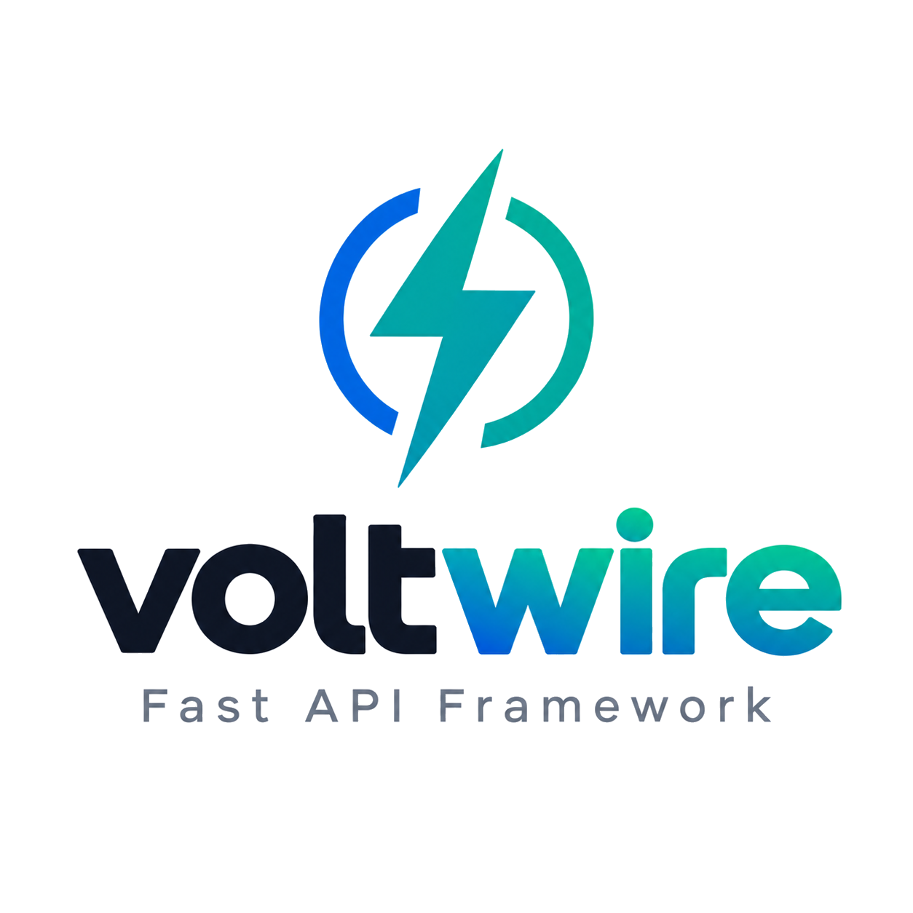

<p align="center">
  
</p>

# voltwire

A small collection of framework-agnostic and FastAPI/SQLAlchemy libraries, extracted from
real production use and rebuilt as open source. Each package is independent and independently
published to PyPI; this repo is a monorepo purely for convenience during development.

## Packages

| | Package | Description |
|---|---|---|
|  | [voltwire-di-core](voltwire-di-core) | Framework-agnostic DI container & `@component` auto-discovery |
|  | [voltwire-db-session](voltwire-db-session) | Configurable SQLAlchemy session factory |

## Development

This repo is a [uv workspace](https://docs.astral.sh/uv/concepts/projects/workspaces/). From the repo root:

```bash
uv sync --all-packages                              # install all packages + dev dependencies
uv run --project voltwire-db-session pytest         # run a single package's tests
for d in voltwire-*; do (cd "$d" && uv run pytest -q); done   # run every package's tests
```

(Test files aren't run as one combined pytest session — package test modules share filenames
like `test_sample.py` across packages, which pytest's default rootdir/import mode can't
disambiguate when collected together. Running per-package, as above, avoids this.)

Each package remains independently installable and publishable — the workspace only exists
to make local development and cross-package testing convenient.

## License

MIT
